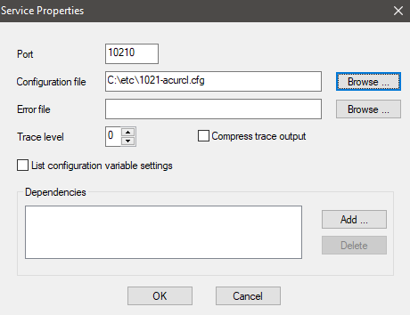

# AcuConnect - Multiple Services Setup

This guide does not go into the initial setup of AcuConnect but rather focuses on setting up multiple services on a server. The following prerequisites should have already been setup:  

1.	[Install AcuConnect](https://docs.rocketsoftware.com/bundle/acucobolgt_dg_1051_html/page/BKCNCNSERVCN22.html)
2.	[Establish system security](https://docs.rocketsoftware.com/bundle/acucobolgt_dg_1051_html/page/BKCNCNSERVCN23.html)
3.	[Create the required aliases](https://docs.rocketsoftware.com/bundle/acucobolgt_dg_1051_html/page/BKCNCNSERVCN24.html)

**Create the Server Configuration File**

Depending on the configuration options used, you will need to use separate configuration files for each service. You could differentiate between these configuration files by naming it according to which version it will be used for i.e. 1021-acurcl.cfg, 1030-acurcl.cfg etc.  

You may want to change the values used for the variables ACCESS-FILE, SERVER_ALIAS_FILE, SERVER_RUNTIME etc. to be used by a particular version of AcuCOBOL-GT.  

Once you have the server configuration files correctly set for each version of the AcuConnect service you are creating then you are ready to create the services.  


**Create the AcuConnect Services**

Open up the AcuConnect Control Panel making sure to open it to 'Run as Administrator' so that you have the correct permissions to create the services.  

When you create the AcuConnect services you need to make sure that you use a different port for each version. You could set the port number to resemble the version you are using like port number 10210 for 10.2.1 and 10300 for 10.3.0. You can then set the configuration file to be used to the specific one you created for that version (created in the previous step).  

  

Keep doing this for every service you want to create for every version you want to setup. After you have setup every version then you should have multiple version of AcuConnect running on different ports.

 


**Connecting to a specific service with AcuThin**

Now that you have multiple AcuConnect services you need to make sure that you connect to the correct one from the client machine using AcuThin.  

For example, to connect to the 10.2.1 AcuConnect service you will need to use the 10.2.1 version of AcuThin on the client making sure you specify the port number:  

```
acuthin.exe serverNameOrIP:10210 aliasName
```

If you want to connect to the 10.3.0 AcuConnect service then you would need to use the 10.3.0 version of AcuThin on the client and specify the correct port number for the 10.3.0 service:

```
acuthin.exe serverNameOrIP:10300 aliasName
```

**Using a different runtime configuration file for each version**

You may want to specify a different runtime configuration file to use when using a specific version of AcuConnect. To do this you would need to create multiple Alias entries and change the runtime configuration file used by each one:  

 

In this example I have created a new runtime configuration file and included the version number in it's name. I have then created a new Alias, also with the version number in its name, and configured it to use the correct configuration file.  

I have also created another Alias entry for version 10.3.0 so now I have 2 aliases for the same program but they use a different runtime configuration file depending on which version I am using:  

 

