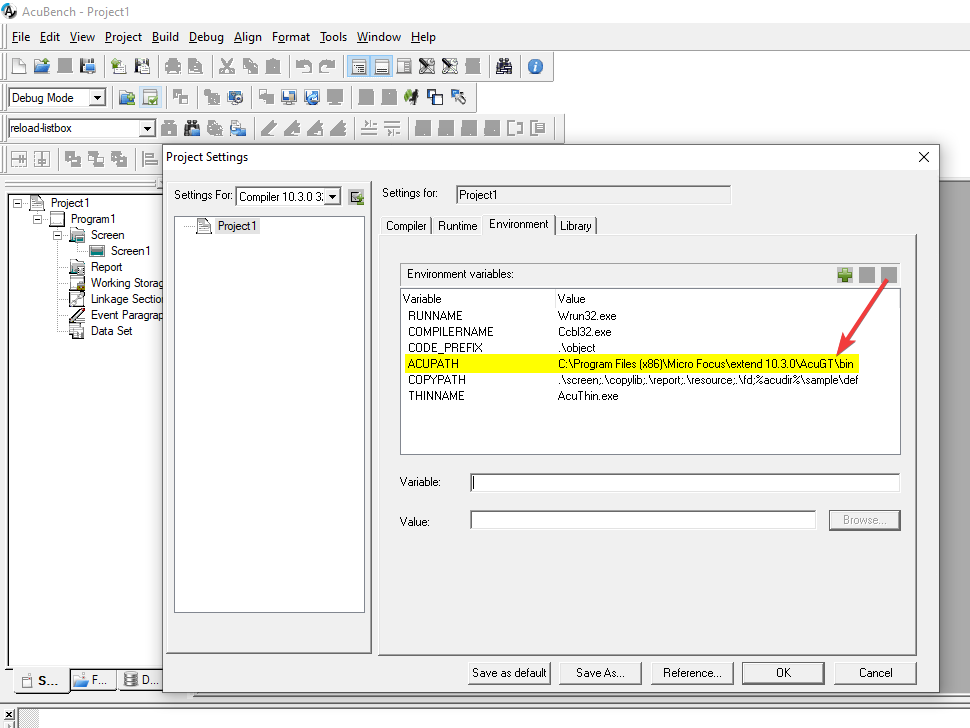
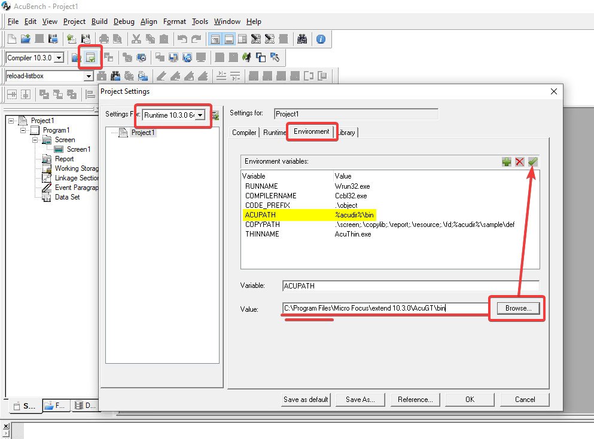
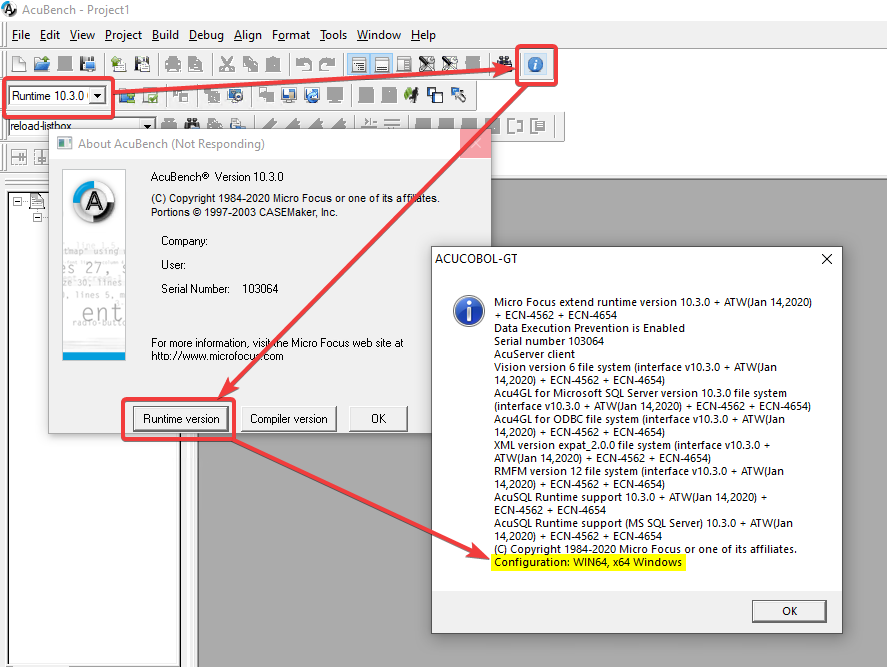

# 10.3.0 64-bit native for Windows

**Install 10.3.0 64-bit**

This time you will need to use the 64-bit setup: “extend(R) Version 10.3.0 x64.exe” (or .msi, it’s the same)

This will install the software in 2 sub-folders:  

C:\Program Files\Micro Focus\extend 10.3.0  
C:\Program Files (x86)\Micro Focus\extend 10.3.0   

**NOTE: The Compiler is installed only in the 32-bit x86 folder.  
So does AcuBench, as they are only 32-bit.  
But beginning with 10.2.0 you can compile the code as 64-bit native for Windows.**  

**Activate the licenses**

Dev-Sys 32-bit (AcuBench + Compiler + Test runtime)  
AcuToWeb 64-bit  
AcuRuntime 64-bit  

**Compile in AcuBench 10.3.0**

You still need to use the 32 bit compiler. Create 2 different Project Settings, one per environment as shown in this screenshot:

For each of them, you will set the environment related to the ACU version to use. 

**10.3.0 Compiler 32-bit** will point to its own compiler and will use the option --x64_Win  
In the 'Compiler' tab use the drop down menu to select 'Native Code Options'. In this section tick to enable 'Generate native code' and then in the drop down menu select 'x64 Windows (--x64_win)'  

When done, you can verify the version in use by:  
1.	Change the combo box for the Project Settings and select 'Compiler 10.3.0 32-bit'
2.	Click on the blue info icon
3.	Click on Compiler version

At this point you can compile your programs for the 10.3.0 64-bit runtime.  

**PLEASE BE AWARE THAT THESE PROGRAMS CAN BE EXECUTED BY THE 10.3.0 64-BIT RUNTIME, ONLY.**

It is advised to create a different “Object” folder in which to save the new compiled objects .acu.  
Now, you can set your Runtime 10.3.0 64 bit environment to run your tests.  

Please note the last line of this popup.  

**Configuration: WIN64, x64 Windows**  

This is the runtime to use.  

It is advised to first test 10.3.0 as a standalone runtime (wrun32.exe) and then test AcuToWeb.  
It will be important to verify the performance improvement given by the option –x64_Win   
