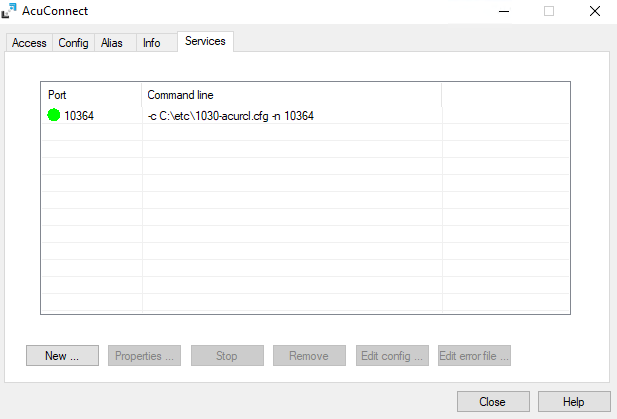
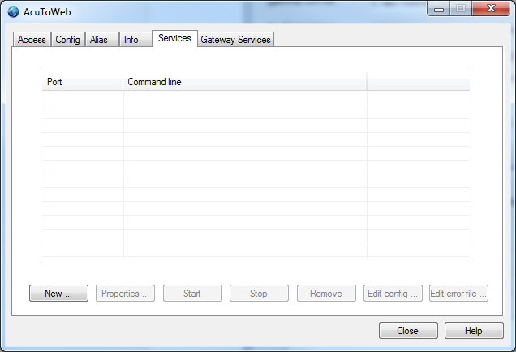
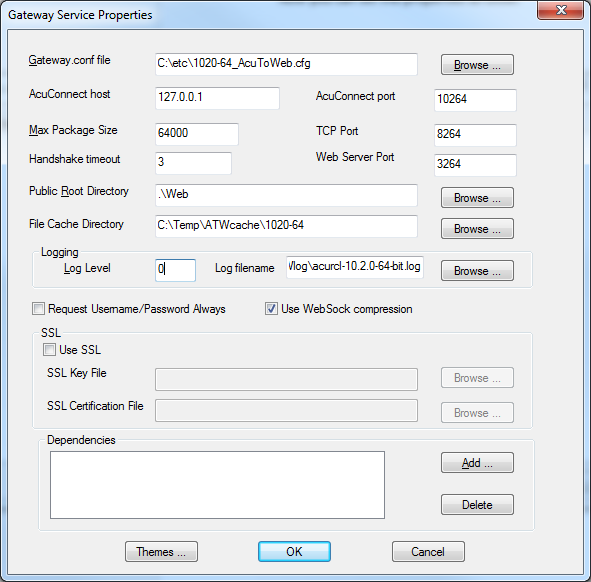
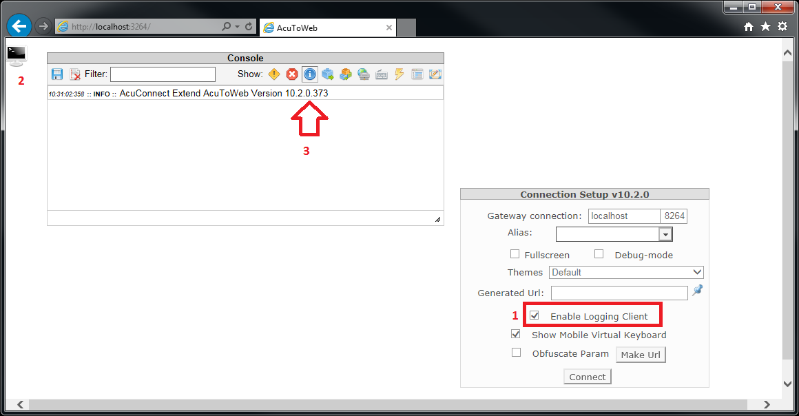
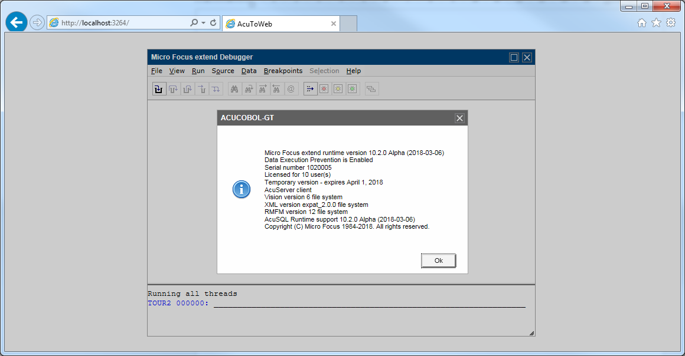

# AcuToWeb and the 64 bit runtime

**Install extend 64-bit**

You will need to use the 64-bit setup: “extend(R) Version 10.2.0 x64.exe” (or .msi, as you prefer)  

This will install the software in 2 sub-folders:

C:\Program Files\Micro Focus\extend 10.2.0  
C:\Program Files (x86)\Micro Focus\extend 10.2.0  

**Configure AcuConnect Thin Client**

Start AcuConnect Control Panel 10.2.0 64-bit from here:

"C:\Program Files\Micro Focus\extend 10.2.0\AcuGT\bin\acurcl.exe"

Create your AcuConnect Service as usual.

You can keep your Access and Alias file as they are. There’s no need to regenerate, them.

I am using a port which helps me to identify the version in use: 10264

Usually the default port is 5632 for AcuConnect. You can use 5632 if you have only this AcuConnect running on this machine. If you are launching more services, you can use your own value for the port.
 
**Configure AcuToWeb**

The control panel is 32-bit only, so you must use this one:

C:\Program Files (x86)\Micro Focus\extend 10.2.0\AcuGT\bin\AcuToWeb.exe

The 64 bit AcuConnect service will NOT be shown in the AcuToWeb Control Panel. This Control Panel shows only the 32 bit Services for AcuConnect.

For this reason, if you need to stop/start the AcuConnect 10.2.0 64-bit service, you have to use the 64-bit Control Panel as suggested before.  

Now you can set the properties as normal.

Then start the Gateway service and connect to your AcuToWeb using your browser.

Please note your AcuToWeb Desktop tool is still 32-bit, and it’s available here as default:

C:\Program Files (x86)\Micro Focus\extend 10.2.0\AcuToWeb\AcuToWeb Desktop

**Check runtime version**

To check you are using the correct 10.2.0 64-bit runtime, use one of the following methods:

Or even better, launch the program using the Debug-mode and click on Help > About the Runtime:

