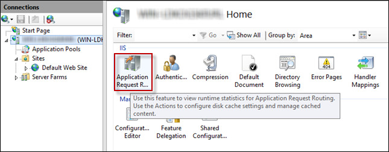
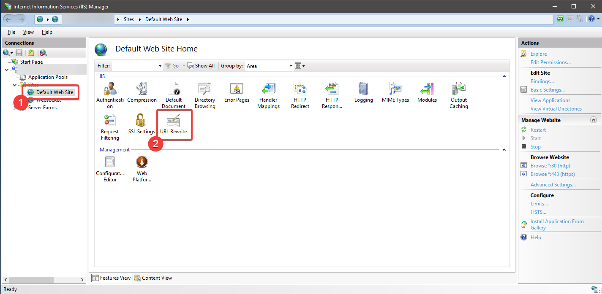
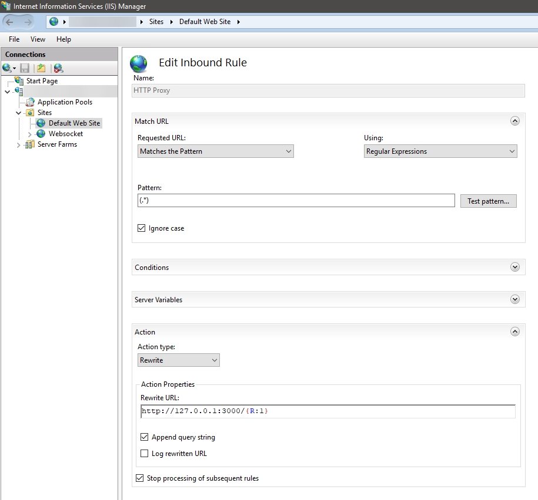
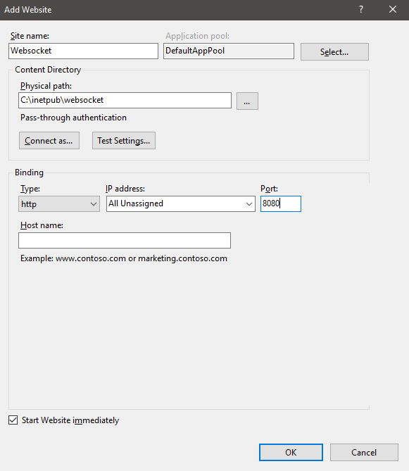
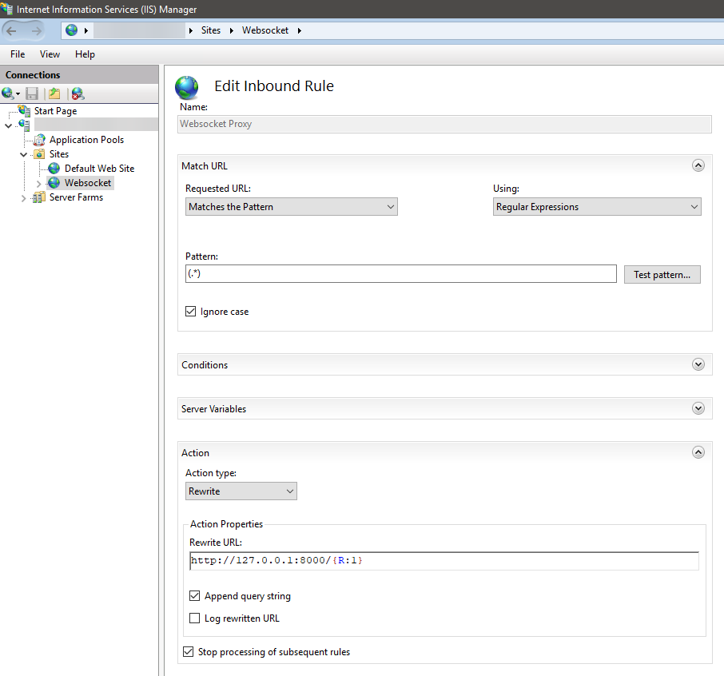
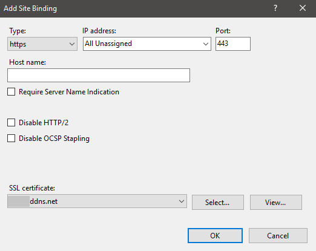

# Configure IIS with AcuToWeb

- [Prerequisites](#prerequisites)
    - [Install and Setup AcuToWeb](#install-and-setup-acutoweb)
    - [Install IIS](#install-iis-with-websocket-support)
    - [Install ARR](#install-arr)
    - [Install URL Rewrite](#install-url-rewrite)
    - [Create and Import Server Certificates in IIS](#create-and-import-server-certificates-in-iis)
    - [OPEN ports 443 and 8080](#open-ports-443-and-8080)
- [Rewrite Rules](#rewrite-rules)
- [SSL Setup and Binding](#ssl-setup-and-binding)
- [Optional](#optional)
    - [Short URL](#short-url)

## Prerequisites

### Install and Setup AcuToWeb

Installation and setup instructions can be found [here](https://github.com/UNiXMIT/UNiXextend/blob/master/docs/AcuToWeb-WINDOWS.md).  

Take note of the WebServer port and TCP port you assigned when creating the service. You will need it later.  

**IMPORTANT:** Due a limitation of ARR 3.0, this component does not support compressed WebSocket frames; therefore, IIS is not capable of routing them. To make the WebSocket Proxy rule work, compression must not be enabled in AcuToWeb. Add the following to your gateway configuration file:

```
WS_COMPRESSION 0
```

### Install IIS with Websocket support

**NOTE:** You must use IIS version 8 or later, as this provides WebSocket support; IIS version 8 is supported on Windows Server 2012 and later.  
For more information, visit http://www.iis.net/learn/get-started/whats-new-in-iis-8/iis-80-websocket-protocol-support.  

1. On the Start page, click the Server Manager tile, and then click OK.   

2. In Server Manager, select Dashboard, and click Add roles and features.  

3. In the Add Roles and Features Wizard, on the Before You Begin page, click Next.  

4. On the Select Installation Type page, select Role-based or Feature-based Installation and click Next  

5. On the Select Destination Server page, select a server from the server pool, select your server, and click Next.  

6. On the Select Server Roles page, select Web Server (IIS).  


7. Click Next 3 times to reach the 'Role Services' section. This is where you enable Websocket support. It can be fou d in the tree view under WebServer -> Application Development -> then check the option for 'Websocket Protocol'.

8. Click Next and then Install.

9. On the Installation Progress page, confirm that your installation of the Web Server (IIS) role and required role services completed successfully, and then click Close.  

10. To verify that IIS installed successfully, type the following into a web browser:  

    http://localhost  

    You should see the default IIS Welcome page.

### Install ARR

1. Download and install Application Request Routing (ARR 3.0) - http://www.iis.net/downloads/microsoft/application-request-routing

2. Configure ARR as a forward proxy:

    2a. Double-click Application Request Routing Cache

    

    2b. Click Server Proxy Settings.

    2c. Select Enable Proxy, then click Apply.

### Install URL Rewrite

Download and install URL Rewrite: http://www.iis.net/downloads/microsoft/url-rewrite

### Create and Import Server Certificates in IIS

If you plan to secure the ports with SSL, make sure you have created and/or imported your Server certificates in IIS for the domain you have asigned to your Server IP. We need these to be available when binding ports to the sites we will setup.  
You could use a 3rd party tool like [Certify The Web](https://certifytheweb.com/) to help you install, manage and renew your certificates on IIS.  

### OPEN ports 443 and 8080

You must ensure that the ports you are assigning in IIS are OPEN in order to allow IIS to receive the traffic that is being routed to AcuToWeb. In this setup I opened ports 443 and 8080 in the Windows firewall.  

## Rewrite Rules

1. In IIS, under the section 'Sites' on the left hand side, select 'Default Web Site', then double-click URL Rewrite.



2. Click Add Rule in the Actions section on the right side, then click Blank rule.

    2a. In the Edit Inbound Rule dialog box, type 'HTTP Proxy' in the Name field.

    2b. Select 'Regular Expressions' in the Using field.

    2c. Enter '(.*)' in the Pattern field.

    2d. In the Action section, select Rewrite in the Action Type field.

    2e. Type http://127.0.0.1:3000/{R:1} in the Rewrite URL field (In my example I am using AcuToWeb WebServer port 3000 but yours may be different).

    2f. Check Stop Processing, the click Apply.



3. In IIS, on the left side, right click Sites then click Add Website.

    3a. Enter 'Websocket' in the Site name field.

    3b. Enter a Physical Path for the Content Directory.

    3c. Change the port to an available port i.e. 8080 and then click OK.

    

    3d. Double-click URL Rewrite then click Add Rule in the Actions section on the right side, then click Blank rule.

    3e. In the Edit Inbound Rule dialog box, type 'Websocket Proxy' in the Name field.

    3f. Select 'Regular Expressions' in the Using field.

    3g. Enter '(.*)' in the Pattern field.

    3h. In the Action section, select Rewrite in the Action Type field.

    3i. Type http://127.0.0.1:8000/{R:1} in the Rewrite URL field (In my example I am using AcuToWeb TCP port 8000 but yours may be different).  

    3j. Check Stop Processing, the click Apply.  



4. IIS should now route your request through the ports assigned via IIS to AcuToWeb on the server. HTTP requests route from port 80 on IIS to port 3000 in AcuToWeb. Websocket requests route from port 8080 on IIS to port 8000 in AcuToWeb.   

**IMPORTANT:** With this configuration, the AcuToWeb Gateway is hidden behind IIS and it only reachable via the ports bound in IIS; therefore, it is mandatory to use the portgw  and hostgw parameters to override the gateway configuration; for example:  

```
http://12.345.678.912?hostgw=12.345.678.912&portgw=8080&alias=tour  
```

## SSL Setup and Binding

If you want to use SSL certificates to secure the connections in IIS, you need to modify the bindings on the sites we have already created and assign the SSL certificates to both ports i.e. port 443 for HTTP and port 8080 for Websockets.  

1. In IIS click Default Web Site -> Bindings -> then click Add in the new window.

    1a. Change the Type to HTTPS.

    1b. Set Port to 443. This is the default secure port number. Notice that it's no longer port 80 as we set before for non secure connections.  

    1c. In the SSL Certificate box select the SSL certificates, which you should have already created and imported in IIS, then click OK.

    1d. Port 443 is now secure with SSL.

    

2. Repeat step 1 for the Websocket site. You can edit the binding we already setup for port 8080, securing it with SSL certificates as we did in step 1.  

3. IIS should now route your request through the ports assigned via IIS to AcuToWeb on the server. HTTPS requests route from port 443 on IIS to port 3000 in AcuToWeb. Secure Websocket requests route from port 8080 on IIS to port 8000 in AcuToWeb.   

**IMPORTANT:** With this configuration, the AcuToWeb Gateway is hidden behind IIS and it only reachable via the ports bound in IIS; therefore, it is mandatory to use the portgw  and hostgw parameters to override the gateway configuration; for example:  

```
http://domain.com?hostgw=domain.com&portgw=8080&alias=tour  
```

## Optional

### Short URL

You can configure the URL Rewrite to proxy a short URL rather than using the URL with a long query string. For example:  

```
https://domain.com/?id=tour
```

will be proxied to

```
https://domain.com/?portgw=8080&hostgw=domain.com&alias=tour&theme=tour
```

and 'tour' can be dynamically replaced with any alias you have setup.

#### HTTP web.config example
```
<?xml version="1.0" encoding="UTF-8"?>
<configuration>
    <system.webServer>
        <rewrite>
            <rules>
                <clear />
                <rule name="ShortURL" stopProcessing="true">
                    <match url="(.*)" />
                    <conditions logicalGrouping="MatchAll" trackAllCaptures="false">
                        <add input="{QUERY_STRING}" pattern="^id=([A-Za-z0-9-]+)$" />
                    </conditions>
                    <action type="Rewrite" url="http://127.0.0.1:3000/{R:1}?portgw=8080&amp;hostgw=domain.com&amp;alias={C:1}&amp;theme={C:1}" />
                </rule>
                <rule name="HTTP Proxy" stopProcessing="true">
                    <match url="(.*)" />
                    <conditions logicalGrouping="MatchAll" trackAllCaptures="false" />
                    <action type="Rewrite" url="http://127.0.0.1:3000/{R:1}" />
                </rule>
            </rules>
        </rewrite>
    </system.webServer>
</configuration>
```

**NOTE:** Notice how the new ShortURL rule preceeds the original catch all rule that we created 'HTTP Proxy'. It is required to be this way otherwise the original rule will match everything and the ShortURL rule will not be used.  
The ShortURL rule will only be used when the condition is matched i.e. when the URL contains the query string 'id=AliasName'.  