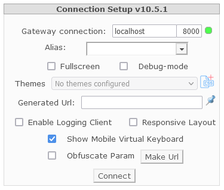

# Installation / Setup of AcuToWeb - LINUX

AcuToWeb on Linux doesn’t have a graphical control panel. The service is started using the acutoweb-gateway command. The AcuToWeb Gateway provides a method where the client specifies an AcuConnect alias to be run. The AcuToWeb Gateway sends the alias information to AcuConnect; therefore, in order to use AcuToWeb, the following are prerequisites:

1.	Install AcuConnect - http://bit.ly/2Gfolh1
2.	Establish system security - http://bit.ly/30LiI3v
3.	Create the required aliases - http://bit.ly/37nocnt

**N.B.** Starting with AcuToWeb 10.3.0 a minimum GCC version is now required:

```
AIX 6.1  -   GCC 7.1.0  
AIX 7.1  -   GCC 7.1.0  
AIX 7.2  -   GCC 7.1.0  
HP 11.31 PA-RISC	-   GCC 4.3.1  
HP 11.31 IA 	-   GCC 4.2.3  
Linux	-   GCC 4.8.0  
Linux PPC	-   GCC 4.1.2-46  
Sun Solaris 10  -   GCC 3.4.3  
Sun Solaris 11	-   GCC 4.8.2  
```

This KB article may help you to diagnose and resolve any issues that may be caused by a GCC version that is too low - http://bit.ly/37FXI15

Because AcuToWeb is only 32 bit, even in the 64 bit version of 10.3.0, you will need to make sure you have installed the 32 bit libraries on your server to allow it to run 32 bit applications. For instance on CentOS this can be achieved by running the following command:

```
yum install libstdc++.i686
```

After performing the steps above (configuring the AcuAccess file, creating an alias in the acurcl.ini file, and starting the AcuConnect service), to start the gateway from the acutoweb directory, enter the following command at a terminal:

```
./acutoweb-gateway –start
```

When the Gateway service is up and running, Open a browser and navigate to the AcuToWeb start page using the syntax: http://[server ip]:[configured port] The default value is http://127.0.0.1:3000. The Connection Setup dialog box appears, which confirms that the Gateway is running:



The Alias entry field specifies the alias of the AcuConnect to be executed. You can populate a list of values by adding them to the fillCombo.js file, which is located in the AcuToWeb\Web\js sub-directory of your installation path.

The following excerpt adds aliases for the Calculator and Tour applications:

```
[
{"type": "category", "text": "Main Applications"},
{"type": "elem", "text": "Calculator", "value": "calc-alias"},
{"type": "elem", "text": "Tour", "value": "tour-alias"}
]
```

You can also type an alias name into the field, then click Make URL, which will generate a URL that you can distribute to customers, which will allow them to paste into their browser and connect to the gateway directly.
