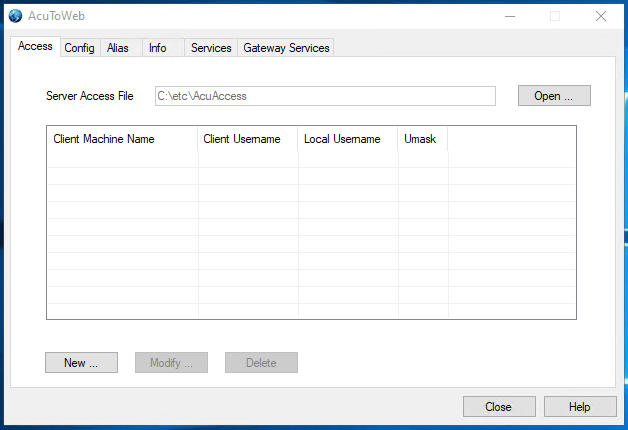
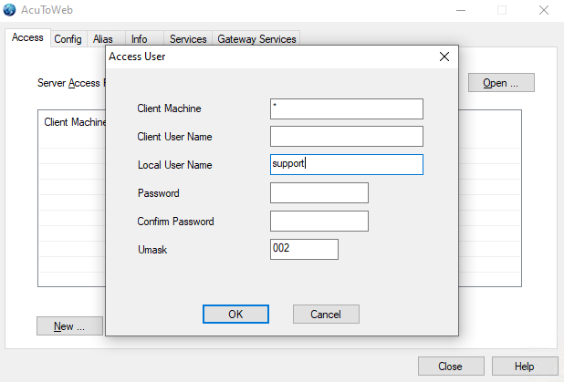
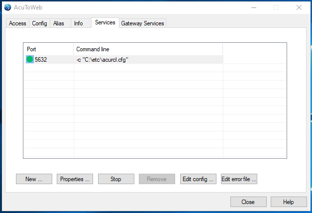
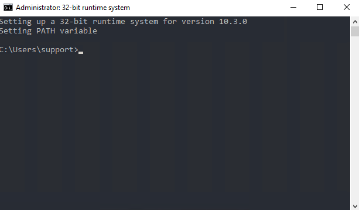
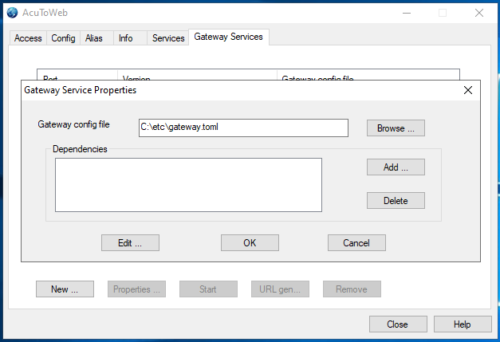
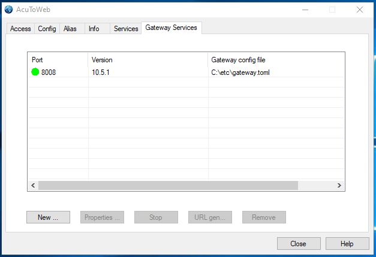
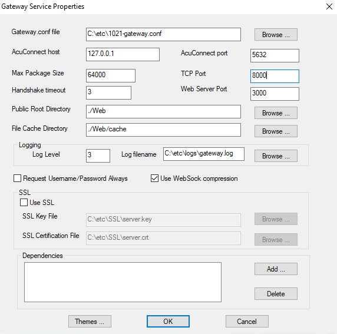
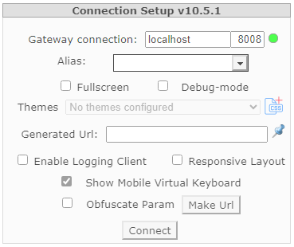

# Installation / Setup of AcuToWeb - WINDOWS

The AcuToWeb Gateway provides a method where the client specifies an AcuConnect alias to be run. The AcuToWeb Gateway sends the alias information to AcuConnect; therefore, in order to use AcuToWeb, the following are prerequisites:

1.	Install AcuConnect - http://bit.ly/2o22bat
2.	Establish system security - http://bit.ly/2otNDgd
3.	Create the required aliases - http://bit.ly/2otNJV7

**Configure AcuConnect Thin Client**

Choose the AcuToWeb control panel from the “All Programs” menu. On Windows 10 you will need to right click the 'extend' Start Menu item and select 'Run as administrator'.



On the Access tab we want to add a new user to the Access file (AcuAccess by default):



On my machine my configuration looks like this:


Let’s configure an Alias on the Alias Tab: 


Now create the AcuConnect Thin Client service:




The file acurcl.cfg contains the server configuration variables; when the file is first installed, these variables are all commented out. You can also modify this file later.

You should now be able to execute your program via thin client. Under extend 10.3.0 open tools and run the 32-bit runtime system command:

```
acuthin localhost alias (acuthin servername alias)
```



**Configure AcuToWeb**

You need to create a new Gateway Service:

First create your gateway.conf file. An example Gateway configuration file can be found in the documentation (http://bit.ly/36kOeGs). Ammend it to fit your needs and make sure ACURCL_PORT matches the port you selected when you created the AcuConnect service earlier.

Now when you click 'New' in the 'Gateway Services' tab a new window will appear prompting you to load your gateway.conf file. Click 'Browse' then find and select the gateway.conf you just created.



Now Click OK to take you back to the previous window. Select the AcuToWeb service that you just created and click 'Start'. The status should change from red to green to show that it is now running.



NOTE: Prior to extend 10.3.0 the properties of the service were created directly in the AcuToWeb Control Panel as shown below. This was an intentional change (http://bit.ly/36kJzVc)



When the Gateway service is up and running, Open a browser and navigate to the AcuToWeb start page using the syntax: http://[server ip]:[configured port] The default value is http://127.0.0.1:3000. The Connection Setup dialog box appears, which confirms that the Gateway is running:



The Alias entry field specifies the alias of the AcuConnect to be executed. You can populate a list of values by adding them to the fillCombo.js file, which is located in the AcuToWeb\Web\js sub-directory of your installation path.
The following excerpt adds aliases for the Calculator and Tour applications:

```
[
{"type": "category", "text": "Main Applications"},
{"type": "elem", "text": "Calculator", "value": "calc-alias"},
{"type": "elem", "text": "Tour", "value": "tour-alias"}
]
```

You can also type an alias name into the field, then click Make URL, which will generate a URL that you can distribute to customers, which will allow them to paste into their browser and connect to the gateway directly.
