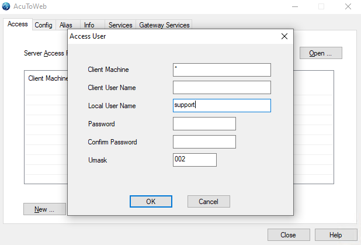
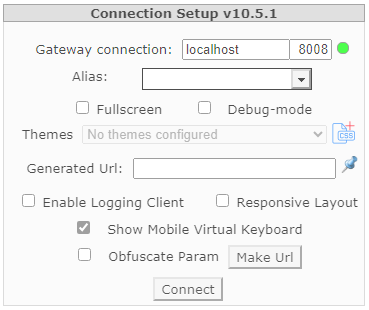

# Installation / Setup of AcuToWeb 11.0.0 - WINDOWS

The AcuToWeb Gateway provides a method where the client specifies an AcuConnect alias to be run. The AcuToWeb Gateway sends the alias information to AcuConnect; therefore, in order to use AcuToWeb, the following are prerequisites:

1.	[Install AcuConnect](https://docs.rocketsoftware.com/bundle/acuextendsuite_ug_1100/page/ddy1742856351216.html)
2.	[Establish system security](https://docs.rocketsoftware.com/bundle/acuextendsuite_ug_1100/page/xch1742856350489.html)
3.	[Creating a Server Alias File in Thin Client](https://docs.rocketsoftware.com/bundle/acuextendsuite_ug_1100/page/qme1742856350732.html)

**Configure AcuConnect Thin Client**

Choose the AcuToWeb control panel from the “All Programs” menu. On Windows 10 you will need to right click the 'extend' Start Menu item and select 'Run as administrator'.

On the Access tab we want to add a new user to the Access file (AcuAccess by default). Click 'New' to open up a new window that will alow you to enter the user access details.


In this setup, all users on any machine are mapped to the user 'support' on the server.




On the Alias tab you can set any programs to be launched in AcuToWeb. We create an alias for each program and any command line options. Click 'New' tp open a new window where you can create an alias.


In the 'Commmand Line' field you can set the program to be launched as well as any other options like specifying a configuration file with '-c cblconfi' for example.


Now create the AcuConnect Thin Client service:


Click 'New' to open a new window where you can specify the port number and configuration file to be used. You can also set any trace options here.


The file acurcl.cfg contains the server configuration variables; when the file is first installed, these variables are all commented out. You can also modify this file later.

You should now be able to execute your program via thin client. Under extend 10.3.0 open tools and run the 32-bit runtime system command:

```
acuthin serverNameorIP:portNum alias 
```

i.e.
```
acuthin localhost:5632 Tour
```
or
```
acuthin 127.0.0.1:5632 Tour
```

**Configure AcuToWeb**

You need to create a new Gateway Service:

First create your gateway.toml file. An example Gateway configuration file can be found in the [documentation](https://docs.rocketsoftware.com/bundle/acucobolgt_dg_1051_html/page/GUID-F17A95F4-172C-43B3-8C22-915643243CED.html). Amend it to fit your needs and make sure acurcl_port matches the port you selected when you created the AcuConnect service earlier. If you are not planning on using SSL then be sure to set use_ssl to 0

Now when you click 'New' in the 'Gateway Services' tab a new window will appear prompting you to load your gateway.toml file. Click 'Browse' then find and select the gateway.toml you just created.


Now click OK to take you back to the previous window. Select the AcuToWeb service that you just created and click 'Start'. The status should change from red to green to show that it is now running.


NOTE: Prior to extend 10.5.0, a gateway.conf was used and was a different format to the gateway.toml file. Please check the correct documentation for the version of AcuToWeb being used.

NOTE: Prior to extend 10.3.0 the properties of the AcuToWeb service were created directly in the AcuToWeb Control Panel as shown below. This was an intentional change Iintroduced in 10.3.0 by ECN-AW141).  


When the Gateway service is up and running, Open a browser and navigate to the AcuToWeb start page using the syntax: http://[server ip]:[configured port] The default value is http://127.0.0.1:3000. The Connection Setup dialog box appears, which confirms that the Gateway is running:



The Alias entry field specifies the alias of the AcuConnect to be executed. You can populate a list of values by adding them to the fillCombo.js file, which is located in the AcuToWeb\Web\js sub-directory of your installation path.
The following excerpt adds aliases for the Calculator and Tour applications:

```
[
{"type": "category", "text": "Main Applications"},
{"type": "elem", "text": "Calculator", "value": "calc-alias"},
{"type": "elem", "text": "Tour", "value": "tour-alias"}
]
```

You can also type an alias name into the field, then click Make URL, which will generate a URL that you can distribute to customers, which will allow them to paste into their browser and connect to the gateway directly.

---


