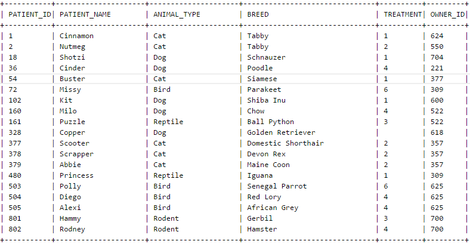

# AcuXDBC Linux Client Setup

### Prerequisites

Install unixODBC:  

RHEL  
```
sudo dnf install unixODBC-devel
```

SLES
```
sudo zypper install unixODBC-devel
```

Ubuntu
```
sudo apt install unixodbc-dev 
```

1.	Type 'odbcinst –j' to find out where your SYSTEM and USER data sources are located:

```
unixODBC 2.3.11
DRIVERS............: /etc/odbcinst.ini
SYSTEM DATA SOURCES: /etc/odbc.ini
FILE DATA SOURCES..: /etc/ODBCDataSources
USER DATA SOURCES..: /home/support/.odbc.ini
SQLULEN Size.......: 8
SQLLEN Size........: 8
SQLSETPOSIROW Size.: 8                     
```

2.	Add the following to the file where your SYSTEM data sources are located: example /etc/odbc.ini:

```
[acuxdbc]
Driver = /home/products/acu1100shx64/bin/acuxdbc.so
Description = AcuXDBC
LoginID = system
```

3.	Set two operating environment variables called VORTEX_HOME and GENESIS_HOME. These environment variables should be set to the root installation directory of AcuXDBC:

```
export VORTEX_HOME=/home/products/acu1100shx64
export GENESIS_HOME=/home/products/acu1100shx64
```

**Note:** the value assigned to the environment variable should not have a '/' as the last character as this can interfere with the installation and configuration scripts.  

4.	Add an entry in $VORTEX_HOME/lib/odbc.ini with the following information. Please create this file if it does not already exist.  

```
fetch_buffer_size   8192  -- fetch buffer size (in bytes)
columns             256   -- max # of database columns
logical_cursors     1024  -- max # of logical cursors
db_cursors          64    -- max # of DB cursors
```

If the information above is for use on a local machine, add the following to the odbc.ini:

```
dsn_acuxdbc "acuxdbc04:%s/%s/xvision:acuxdbc.cfg"
```

If the information above is for use on a server, add the following to the odbc.ini:

```
dsn_acuxdbc "acuxdbc03:%s/%s/xvision:acuxdbc.cfg@20222:servername!acuxdbc04"
```

5.	Environment variables need to be set or modified that point the location of the AcuXDBC executables and to tell the operating system where to find the AcuXDBC shared libraries:

```
export PATH=/home/products/acu1100shx64/bin
export LD_LIBRARY_PATH=/home/products/acu1100shx64/bin:/home/products/acu1100shx64/lib
```

6.	Next modify the AcuXDBC configuration file, acuxdbc.cfg, located at $GENESIS_HOME. If it is not there, create it by running 'genxconf.sh'.  
There are two variables that are required, although others may be needed depending on your situation:

```
#  The path to your system catalog directory
DICTSOURCE      /home/products/acu1100shx64/syscat

#  The path to your data files.  You must prepend the line with a semi-colon,
#  use either double backslashes ("\\") or forward slashes ("/"),
#  and separate your paths by semi-colons.
FILE_PREFIX     ;/home/products/acu1100shx64/data;/home/products/acu1100shx64/sample/acuxdbc/data
```

**Note:** This product only, supports the semi-colon as a separator, not a colon as would be expected on Linux/UNIX.  

7.	Verify that the AcuXDBC licence file, xvision.alc, is located in the bin directory. 

8.	Run setup script demo.sh located at $GENESIS_HOME/bin.

9.	Try to access a sample Vision file using a utility that came with unixODBC:  


```
$ isql -v acuxdbc system manager

+---------------------------------------+  

  Connected!

  sql-statement  
  help [tablename]   
  quit    

+---------------------------------------+  
```

10. Now, attempt to connect to a Vision file called 'pets', that is physically located at $GENESIS_HOME/sample/acuxdbc/data, and whose XFD was loaded by the demo.sh script.  

```
SQL> select * from pets
```

