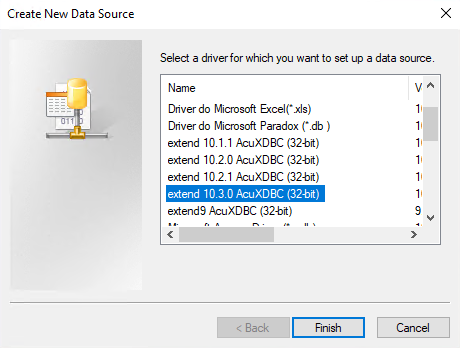
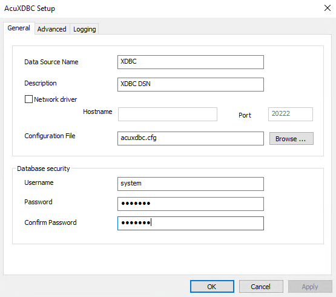
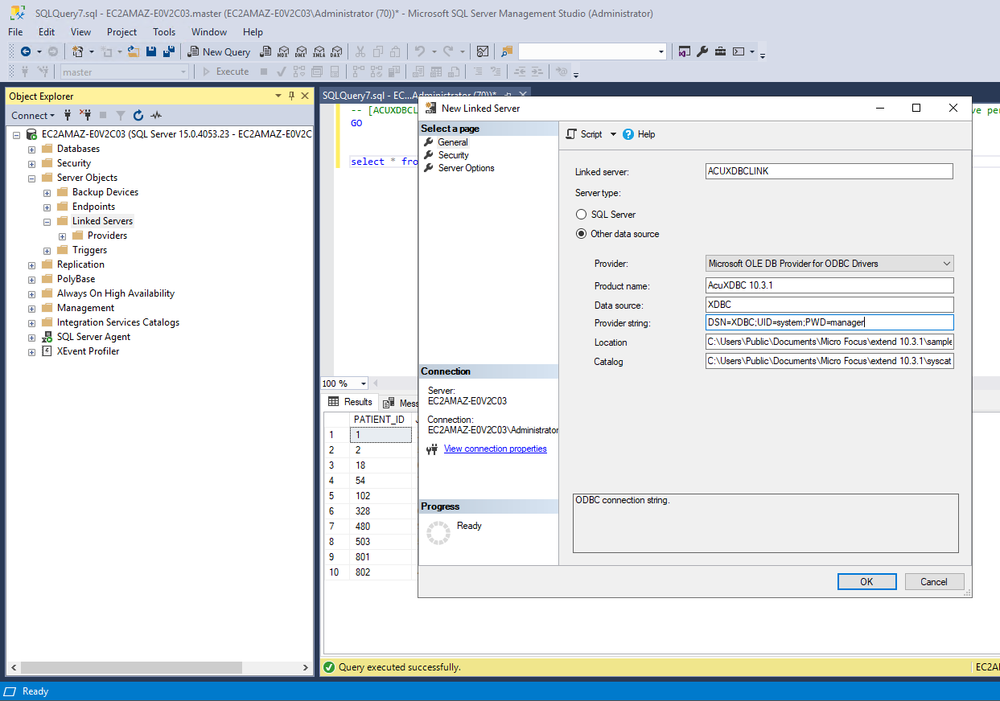
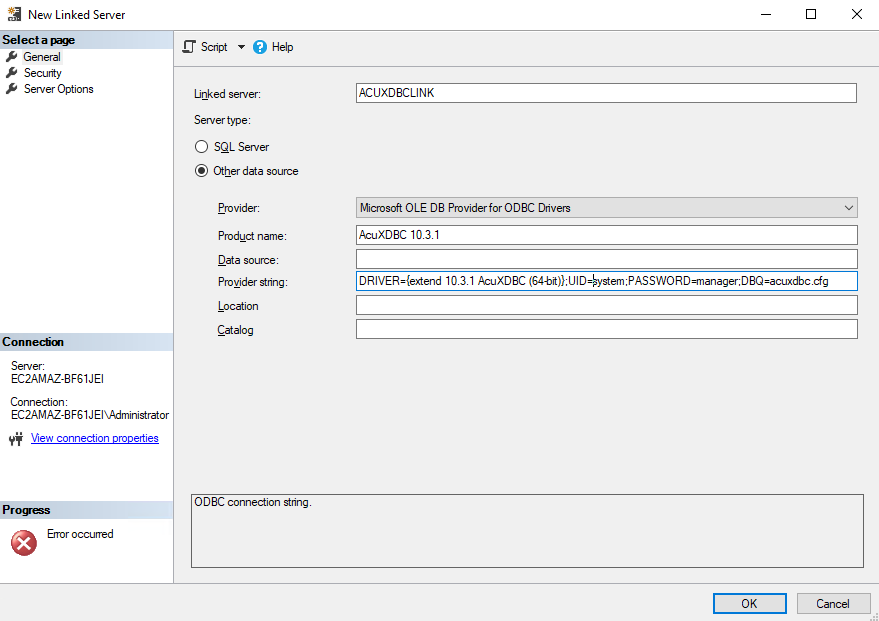

# AcuXDBC MSSQL Linked Server

The following steps require you to have [setup AcuXDBC](AcuXDBC-WINDOWS.md) first.  

**Create an ODBC Data Source (DSN)**

Create a Data Source Name from Control Panel, Administrative Tools, Data Sources (ODBC).  

If you prefer to connect directly using a provider string rather than a DSN, then skip this step and continue with creating the linked server.  

**N.B.**  
- Windows 32-bit uses 32-bit Data Source by default.  
- Windows 64-bit uses 64-bit Data Source by default.  

If you are on a Windows 64-bit and you need to work with AcuXDBC 32-bit and 32-bit Data Sources, the 32-bit “ODBC Data Source Administrator” panel can be opened launching:   

```
C:\Windows\SysWOW64\odbcad32.exe  
```

In the ODBC Data Source Administrator, choose “Add…” and select your AcuXDBC driver.    
Note that the description has changed in 9.1.0 to describe whether it is a 32 or 64-bit driver.    



Fill in the information required:  



Remember to provide user "system" and password "manager" in the Database security fields.  

If you need to connect to a remote AcuXDBC Server, use the related fields Network driver, Hostname and Port.  

Click OK to save the DSN.  

**Create the Linked Server in SSMS**



**Provider String Examples**  

DRIVER={extend 10.3.1 AcuXDBC (64-bit)};UID=system;PASSWORD=manager;DBQ=acuxdbc.cfg  

DRIVER={extend 10.3.1 AcuXDBC (64-bit)};HOST=HostIPAddress;PORTNUMBER:20222;UID=system;PASSWORD=manager;DBQ=acuxdbc.cfg  



**Troubleshooting**  

If, when you are creating your linked server, it complains that it cannot find the AcuXDBC DLLs you will most likely need to restart your machine after setting the GENESIS_HOME and PATH environment variables. After the restart, the DLLs should be located without error.  