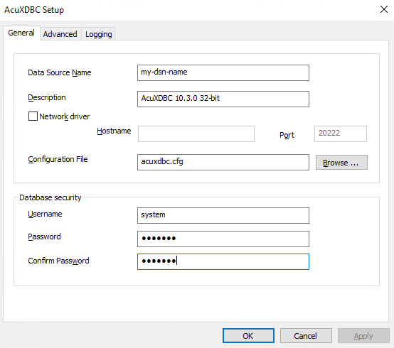

# Installing AcuXDBC Client and Server

The following steps are for Windows.  
To install the product on Windows, use the extend® setup and choose one of the following flags:


AcuXDBC Data Interface for Windows installs the ODBC driver and it’s the Client side of AcuXDBC.

AcuXDBC Server Remote Processing installs the Server side of AcuXDBC.

AcuXDBC Enterprise Edition installs the Server side of AcuXDBC and the JDBC libraries.

AcuXDBC Client can be installed using a standalone installer, too.

The installers are now downloadable from the Micro Focus Support Portal - https://portal.microfocus.com/

Once logged in navigate to Product Updates to find products available to you for download.

During the installation you will be asked to enter your product code and key.

**Set environment variables**

```
set PATH=\pathtotheinstallation\folder\AcuGT\bin;%PATH%
set GENESIS_HOME=\pathtotheinstallation\folder\AcuGT
```

These next steps must be accomplished to complete your installation/configuration of XDBC.

1. Configuration of AcuXDBC
2. Creation of a system catalog
3. Test the system catalog directly (NO ODBC)
4. Creation of an ODBC Data Source 
5. Test the system catalog using ODBC
6. Manage AcuXDBC Server

---

**Quick Start Demo Program**

It is a good idea to run and inspect the quick start demo program before testing with your own data and setup. This way you can understand the process in a working environment first.  

https://www.microfocus.com/documentation/extend-acucobol/1031/extend-Interoperability-Suite/BKXDXDINSTXD5.1.1.html  

Once you are happy with how it works, you can continue on to **Configuration of AcuXDBC** and test with your own data.

**Configuration of AcuXDBC**

Open your installation directory i.e.

C:\Program Files (x86)\Micro Focus\extend 10.3.0\AcuGT

This is where your acuxdbc.cfg config file must be located.   
If it's not present, enter the BIN directory and use the batch program genxconf.bat to generate it.  
Run this batch file with Administrator privileges if necessary.  

When created, open acuxdbc.cfg with an editor to customize it.  
These are the two most important configuration variables:

```
#  The path to your system catalog directory. This is a required variable
DICTSOURCE  "C:\any-path-you-like\syscat" 
#  The path to your data files.  You must prepend the line with a semi-colon, 
#  use either double backslashes ("\\") or forward slashes ("/"), 
#  and separate your paths by semi-colons. This is a required variable
FILE_PREFIX ";C:/any-path-you-like/data"
OR
FILE_PREFIX ";C:\\any-path-you-like\\data"
```

**Optional**

There are other variables in this configuration file that can be useful to set the way values are read and written.  
For instance:  

```
FILE_SUFFIX   			DAT
INVALID_NUMERIC_DATA	ZERO
READ_ONLY			YES
```

Each variable has a brief description in the file itself, so have a look at it before you run the first tests.

---

**Creation of a system catalog**

Next step is to create the SYSTEM CATALOG and load xfd files in it.  
**N.B.** Please note that the syscat directory has to be before proceeding to the next step.

TO CREATE A SYSCAT, use ainit.bat (ainit -help to show the usage)

```
ainit -d C:\any-path-you-like\syscat
```

In some Windows Operating System, you may encounter a problem with spaces in the directory names.  
You will see something like “\Micro was unexpected at this time.”  
This problem can be overcome by using the tool xdbcutil.exe directly:

```
xdbcutil -d C:\any-path-you-like\syscat –c
```

OR put “” around the path i.e. 
“C:\Users\Public\Documents\Micro Focus\extend 10.0.1”

**Load an XFD file**

Use addfile.bat (addfile -help to show the usage)

```
addfile -d C:\path-to-the\syscat -x C:\path-to-the\xfd-directory file-name
```

or, if you prefer to use the tool directly:

```
xdbcutil –d C:\path-to-the\syscat –x C:\path-to-the\xfd-directory  -v -a file-name
```

Where file-name is the name of the Vision/XFD file that you want to load.  
When the names of the Vision and xfd files are the same, you can use just its file-name without any extension.  
When you have different names or you want to use aliases, you can use this syntax: 

```
addfile –d C:\path-to-the\syscat -x C:\path-to-the\xfd-directory  name-of-xfd-file-without-extension#alias#name-of-vision-file
```

Let's say you have a Vision file named TAB000001 with a xfd file named tabfields.xfd.  
You can load a friendlier name in the syscat to use in your future query:

```
addfile -d C:\path-to-the\syscat -x C:\path-to-the\xfd-directory tabfields#CLIENTS#\data\TAB000001
```

If you need to load a list of xfd files, you can write a text file with the list of the xfd to load, which content is:

```
TAB000001
TAB000002
TAB000003
tabfields#CLIENTS#C:\data\TAB000004 
TAB000005
```

Run this command line: 
```
addfile -d C:\path-to-the\syscat -x C:\path-to-the\xfd-directory -f file-list.txt
```

TO UPDATE A XFD that's been already loaded, this is the syntax to use: 
```
xdbcutil -d C:\path-to-the\syscat -x C:\path-to-the\xfd-directory -u TAB000001
```

TO LOAD THE TABLE WITHOUT THE PUBLIC. PREFIX, you can run:
```
xdbcutil -d C:\path-to-the\syscat -x C:\path-to-the\xfd-directory  -o " " -a TAB000001
```

AND activate this variable inside acuxdbc.cfg file:
```
IGNORE_OWNER	ON
```

TO LOAD SOME USEFUL VIEWS, use this syntax and the file sql provided with your installation (This is automatically loaded by the 'ainit' script): 
```
asql -r "C:\pathtotheinstallation\folder\bin\cview.sql"
```

---

**Test the system catalog directly (NO ODBC)**

Now it's possible to test AcuXDBC using the tool asql.bat   
**Note:** that this tool will NOT use ODBC libraries, but it will access directly to the Vision files. It is very useful to test paths and syscat)

```
asql
```
or
```
xdbcquery /z /cacuxdbc04:system/manager/xvision:acuxdbc.cfg
```

```
SQL (/? for help) ==>
SQL (/? for help) ==> select * from CLIENTS;
```
```
Use /? to show the help.
```
```
Use /d to show the definition of the table, like: 
SQL (/? for help) ==> /d tCLIENTS
```
(Note the t near the name of the table)

Use this query to see the loaded aliases and owners: 

```
SQL (/? for help) ==> select t_owner, t_name from genesis_tables;
```
Use this query to see other information about the xfd loaded: 
```
SQL (/? for help) ==> select * from information_schema.tables;
```

To quit, use:
```
SQL (/? for help) ==> /q
```

---

**Creation of an ODBC Data Source (DSN)**

Create a Data Source Name from Control Panel, Administrative Tools, Data Sources (ODBC).

**N.B.**
- Windows 32-bit uses 32-bit Data Source by default.
- Windows 64-bit uses 64-bit Data Source by default.

If you are on a Windows 64-bit and you need to work with AcuXDBC 32-bit and 32-bit Data Sources, the 32-bit “ODBC Data Source Administrator” panel can be opened launching: 

```
C:\Windows\SysWOW64\odbcad32.exe
```

In the ODBC Data Source Administrator, choose “Add…” and select your AcuXDBC driver.  
Note that the description has changed in 9.1.0 to describe whether it is a 32 or 64-bit driver.  


Fill in the information required:



Remember to provide user "system" and password "manager" in the Database security fields.

If you need to connect to a remote AcuXDBC Server, use the related fields Network driver, Hostname and Port.

Click OK to save the DSN.

---

**Test the system catalog using ODBC**

To test your DSN use the script odbcsql.bat

```
odbcsql –h
odbcsql -d my-dsn-name
SQL (/? for help) ==> select * from CLIENTS;
```

Or run the tool directly using:

```
xdbcquery /cacuxdbc11:system/manager/my-dsn-name
```  
  
If everything works fine, you can open MS Access or MS Excel and use AcuXDBC to link your Vision files.
  
  

---

**Manage AcuXDBC Server**

To manage AcuXDBC Server, use acuxdbcs.bat

```
acuxdbcs –h
Usage:
       acuxdbcs –help
       acuxdbcs -info [-n port] [server]
       acuxdbcs -kill [-n port] [server]
       acuxdbcs -start [-n port] [-l]
```

TO START ACUXDBC SERVER
```
acuxdbcs –start –n 20222
```

TO GET INFO ABOUT ACUXDBC SERVER
```
acuxdbcs –info –n 20222 server
```

TO STOP ACUXDBC SERVER
```
acuxdbcs –kill –n 20222 server
```  
