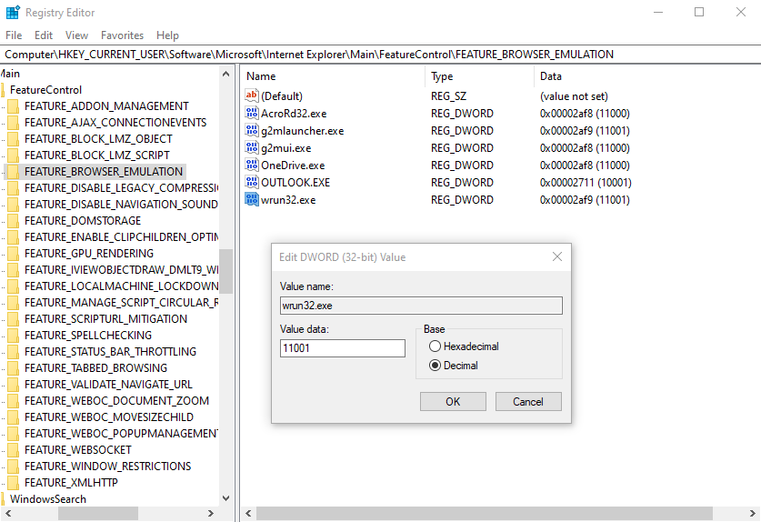

# Registry Key Location for FEATURE_BROWSER EMULATION  

Starting with IE 8, Microsoft introduced registry entries that control browser behavior when a Web Browser Control is embedded into other applications. These registry values are used by many application on your system.  

Essentially you can specify a registry with the name of your Executable and specify the version of IE that you would like to load. The numbers are specified as 11000, 10000, 9000, 8000 and 7000. The keys can be specified either for the current user (HKCU) or globally for all users (HKLM).  

You can specify these keys in the registry at:

```
HKEY_CURRENT_USER\SOFTWARE\Microsoft\Internet Explorer\Main\FeatureControl\FEATURE_BROWSER_EMULATION  
```

The HKCU key is the best place to set these values because there's a single key and it can be set without admin rights, but you can also set these keys at the machine level at HKLM:  

```
HKEY_LOCAL_MACHINE\SOFTWARE\Microsoft\Internet Explorer\MAIN\FeatureControl\FEATURE_BROWSER_EMULATION  
```

or for a 32 bit application on a 64 bit machine:  

```
HKEY_LOCAL_MACHINE\SOFTWARE\WOW6432Node\Microsoft\Internet Explorer\Main\FeatureControl\FEATURE_BROWSER_EMULATION  
```

**Key Name**  

The keyname is the EXE name of your application like:   

```
wrun32.exe
```

**Values**  

The value specifies the IE version as follows.  

The value to set this key to is (taken from [MSDN](https://bit.ly/3ix6Edx)) as decimal values:  

**11001 (0x2AF9)**  
Internet Explorer 11. Webpages are displayed in IE11 Standards mode, regardless of the !DOCTYPE directive.  

**11000 (0x2AF8)**  
Internet Explorer 11. Webpages containing standards-based !DOCTYPE directives are displayed in IE11 mode.  

**10001 (0x2AF7)**  
Internet Explorer 10. Webpages are displayed in IE10 Standards mode, regardless of the !DOCTYPE directive.  

**10000 (0x2710)**  
Internet Explorer 10. Webpages containing standards-based !DOCTYPE directives are displayed in IE10 mode.  

**9999 (0x270F)**  
Internet Explorer 9. Webpages are displayed in IE9 Standards mode, regardless of the !DOCTYPE directive.  

**9000 (0x2328)**  
Internet Explorer 9. Webpages containing standards-based !DOCTYPE directives are displayed in IE9 mode.  

**8888 (0x22B8)**  
Webpages are displayed in IE8 Standards mode, regardless of the !DOCTYPE directive.  

**8000 (0x1F40)**  
Webpages containing standards-based !DOCTYPE directives are displayed in IE8 mode.  

**7000 (0x1B58)**  
Webpages containing standards-based !DOCTYPE directives are displayed in IE7 Standards mode. This mode is kind of pointless since it's the default.  

Setting these keys enables your applications to use the latest Internet Explorer versions on your machine.  

