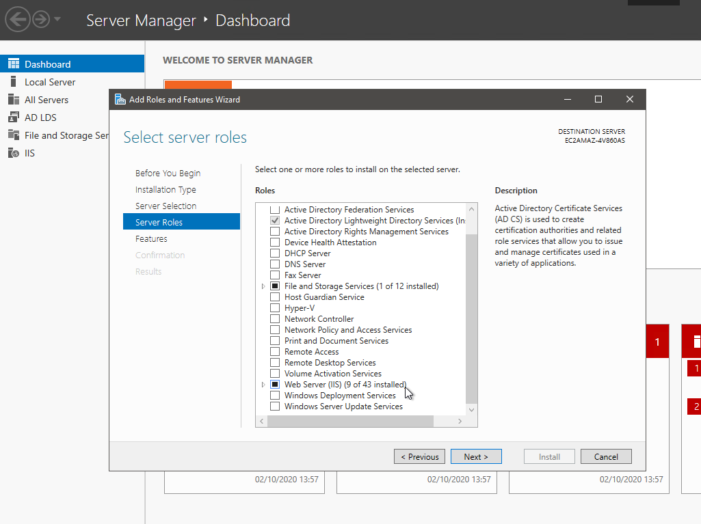
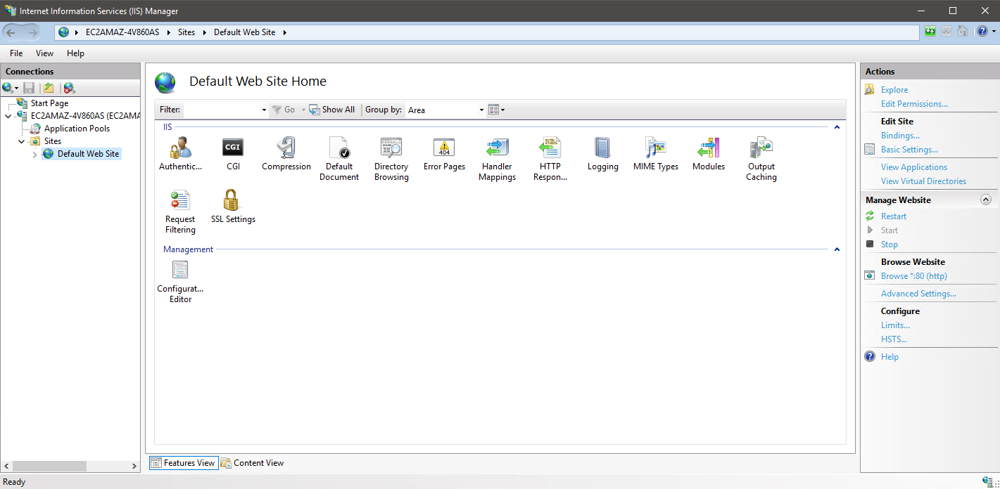
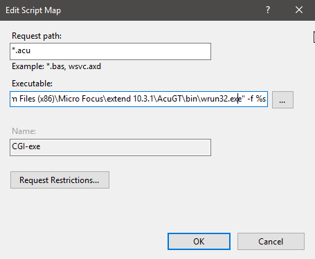
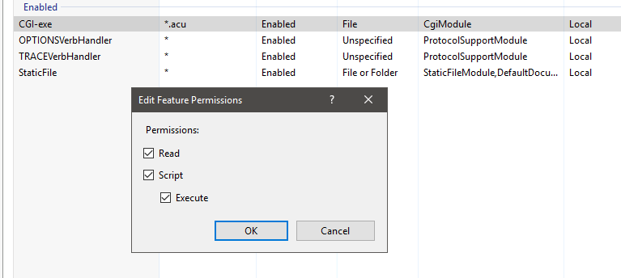

# Install IIS/CGI on Windows Server 2019  

1. On the Start page, click the Server Manager tile, and then click OK.   

2. In Server Manager, select Dashboard, and click Add roles and features.  

3. In the Add Roles and Features Wizard, on the Before You Begin page, click Next.  

4. On the Select Installation Type page, select Role-based or Feature-based Installation and click Next  

5. On the Select Destination Server page, select a server from the server pool, select your server, and click Next.  

6. On the Select Server Roles page, select Web Server (IIS).  

7. Click next 3 more times until you reach the 'Role Services' page.

8. Expand 'Web Server' > 'Application Development' and check the 'CGI' box. Click next.

9. On the Installation Progress page, confirm that your installation of the Web Server (IIS) role and required role services completed successfully, and then click Close.  

10. To verify that IIS installed successfully, type the following into a web browser:  

    http://localhost  

    You should see the default IIS Welcome page.   

11. Start 'Internet Information Services (IIS) Manager' and click the "Default Web Site" in the Connections Panel (left).  

12. Double click the "Handler Mappings" icon in the Home panel (center).  

13. Double click the "CGI-exe" item and an "Edit Script Map" pop-up window will appear.  

14. Type '*.acu' in the "Request path" field.  

15. Type C:\PathTo\AcuGT\bin\wrun32.exe -f %s in the "Executable" field.  

16. Click "OK" to close the "Edit Script Map" pop-up window.  

17. This will trigger an "Edit Script Map" question asking if you want to allow this ISAPI extension. click "Yes".  

18. Right click on the CGI-exe entry you just edited and select 'Edit feature permissions'.  

19. Make sure the 'Execute' check box is enabled then click OK.  

20. At this point you should be able to setup and run the cgi/oscars.acu sample program.  
