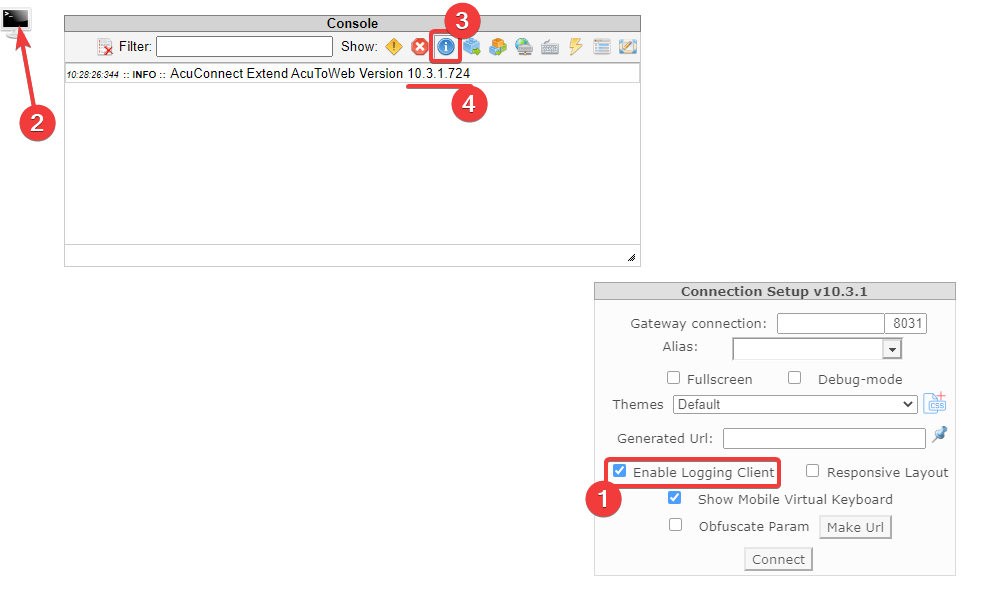

# ACUCOBOL-GT Trace Files For Troubleshooting  
## Evironment
All versions of AcuCOBOL-GT extend on all platforms  

## Situation
How to generate logs for all AcuCOBOL-GT extend products?

## Resolution
Customer support engineers frequently require a log file in order to troubleshoot an issue; therefore it is expedient to include these files when reporting a problem. Following are instructions for obtaining commonly required logs to attach to your support case. There are alternatives for some of these instructions, such as setting configuration variables. Use those ways if they are more familiar to you.

- [General Information](#general-information)
- [Runtime](#runtime)
- [Compiler](#compiler)
- [Thin Client](#thin-client)
- [AcuToWeb](#acutoweb)
- [AcuToWeb Build](#acutoweb-build)
- [AcuToWeb Desktop](#acutoweb-desktop)
- [Browser Console Log](#browser-console-log)
- [AcuServer](#acuserver)
- [AcuXDBC](#acuxdbc)
- [Abend Diagnostic Report](#abend-diagnostic-report)
- [Process Monitor Log](#process-monitor-log)

**Note:** The log files described here are a helpful starting place; additional tracing may be requested by Customer Care to further troubleshoot.  

### General Information
#### Log Name
All of the log and list files described below may be assigned any name which can include the path. The Runtime log in recent versions may use wildcards to include unique information in the name:  

```
%p - process id
%d - date (YYYYMMDD)
%t - time
%u - username
%h - hostname
```

For example, the following:  

```
wrun32.%p.log
```

will generate a log which includes the PID value in the file name:  

```
wrun32.12345.log
```

#### Compressed logs
The Runtime, AcuServer, and AcuConnect can automatically produce compressed log files by adding the -g option. It is advisable to give the log file an extension of .gz or .zip to indicate it is a compressed archive.  

#### Timestamps
To include timestamps on each line of the log files (does not apply to AcuXDBC logs), before proceeding with the following instructions set this in the environment, or add it to the related configuration file:  

```
FILE_TRACE_TIMESTAMP 1
```

### Runtime
1. Add "-dlxe runtime.log" to the Runtime command line. So it will be something like this on Unix-like OS:  
    
    ```
    runcbl -dlxe runtime.log <other options> programName
    ```

    Or like this on Windows:  

    ```
    wrun32 -dlxe runtime.log <other options> programName
    ```

2. At the debugger prompt enter 'tf 9', then 't flush', then 't timestamp', then 'g' *. Exercise your program to produce the bad behaviour, and then exit if the Runtime hasn't already terminated.  
*Alternatively, if you don't want to or can't run the program in debug mode, add the following variables to the environment or to the runtime configuration file:  

    ```
    FILE_TRACE 9
    FILE_TRACE_FLUSH 1
    FILE_TRACE_TIMESTAMP TRUE
    ```

3. Zip up runtime.log and attach to the support case.

### Compiler
1. Add "-lcfoswx @.lst" to your compile options. So you'll have something like this on Unix-like OS:

    ```
    ccbl -lcfoswx @.lst <other options> programName.cbl
    ```

    Or like this on Windows:

    ```
    ccbl32 -lcfoswx @.lst <other options> programName.cbl
    ```

2. Zip up the list file and attach to the support case.

### Thin Client
1. Stop AcuConnect then restart with logging. Add "-le acurcl.log -t7" to the AcuConnect start command. Something like:

    ```
    acurcl -start -c acurcl.cfg -le acurcl.log -t7
    ```

    On Windows use the AcuConnect Control Panel, Services tab. Stop the service, edit the properties of the service to specify the error file, set trace level 7, and select the "List configuration …" option, then start the service.  

2. Modify the target command line in the shortcut on the client to add "-dlxe runtime.log". It will be something like:

    ```
    acuthin.exe server:port -dlxe runtime.log aliasName
    ```

3. At the debugger prompt enter 'tf 9', then 't flush', then 't timestamp', then 'g' *. Exercise your program to produce the bad behaviour, and then exit if the Runtime hasn't already terminated. If you did not include the path for the log file name it will be located in the working directory specified in the alias.  
*Alternatively, if you don't want to or can't run the program in debug mode, add the following variables to the environment or to the runtime configuration file:  

    ```
    FILE_TRACE 9
    FILE_TRACE_FLUSH 1
    FILE_TRACE_TIMESTAMP TRUE
    ```
    
4. Zip up acurcl.log and runtime.log, and attach to the support case.

### AcuToWeb
1. Stop the AcuToWeb service. Open the gateway.conf or gateway.toml (depending on AcuVersion) file in Notepad or other text editor.

2. Adjust the following options to assign the following values (change gateway.log path to suit your setup):

    ```
    # gateway.conf
    LOG_LEVEL      15
    LOGFILE        /path/to/gateway.log
    ```
    ```
    # gateway.toml
    log_level = 15
    logfile = '/path/to/gateway.log'
    ```

3. Start AcuToWeb then exercise your program to produce the bad behaviour, and then exit if the Runtime hasn't already terminated.

4. Zip up the gateway.log and attach to the support case.

### AcuToWeb Build
You can check the build number of AcuToWeb in the following way:  

1. In your browser enter the URL to access the initial AcuToWeb Connection Setup screen. Check the box 'Enable Logging Client'.

2. A monitor icon will appear in the top left of the browser window. Left click it once to make the AcuToWeb Console appear.

3. Left click the 'I' icon (Info) in the Console toolbar to show the AcuToWeb build version in the Console.



### AcuToWeb Desktop
AcuToWeb Desktop stores logs locally within the GUI. The Log Level can be changed from the menu Tools -> Log Level. Set Log Level to Debug. The log can be saved to a file using the menu Tools -> Save Log to File.  

If AcuToWeb Desktop crashes, those log files are lost and cannot be recovered. To write the log straight into a file, you can modify the registry:  
 
```
HKEY_CURRENT_USER\SOFTWARE\Micro Focus\AcuToWeb Desktop

LogFileName C:\temp\ATWDesktop.log
LogOnFile 1
``` 

```
reg add "HKEY_CURRENT_USER\SOFTWARE\Micro Focus\AcuToWeb Desktop" /v LogFileName /t REG_SZ /d "\temp\ATWDesktop.log" /f
reg add "HKEY_CURRENT_USER\SOFTWARE\Micro Focus\AcuToWeb Desktop" /v LogOnFile /t REG_DWORD /d 1 /f
```

**Note:** Make sure you don't have any instances of AcuToWeb Desktop running when you make these registry changes.

### Browser Console Log
Most of the common modern browsers have a browser console log that can be checked for client side errors i.e. websocket issues.  
The contents of the console log can be found and saved using the following instructions:  
 
**Chrome/Edge**
1. Click the 3 dots, at the top-right, to open the overflow menu.
2. Choose 'More tools' > 'Developer tools' to bring up the console.
3. Select the 'Console' tab and make sure the option 'Preserve log' is checked by expanding the options menu using the cog icon on the right side.
4. Reproduce the issue. Data will start to be collected in the console window.
5. Right click on any log statement in the console window, and click 'Save as…' to save the log file to the computer.

**Firefox**
1. Click the burger menu / 3 horizontal lines, at the top-right, to open the overflow menu.
2. Choose 'More tools' > 'Web Developer tools' to bring up the console.
3. Select the 'Console' tab and make sure the option 'Persist logs' is checked by expanding the options menu using the cog icon on the right side.
4. Reproduce the issue. Data will start to be collected in the console window.
5. Right click on any log statement in the console window, and click 'Save all Messages to File' to save the log file to the computer.

### AcuServer
Note: Please send this trace in addition to the runtime.log above.  

1. Stop AcuServer and restart with logging. Add "-le acuserve.log -t7" to the AcuServer start command. Something like:

    ```
    acuserve -start -c a_srvcfg -le acuserve.log -t7
    ```

    On Windows use the AcuServer Control Panel, Services tab. Stop the service, edit the properties of the service to specify the error file, set trace level 7, and select the "List configuration …" option, then start the service.

2. Execute your application until the error happens.

3. Zip up acuserve.log and runtime.log, and attach to the support case.

### AcuXDBC
1. Open the configuration file in Notepad or other text editor. By default that is acuxdbc.cfg located in the directory specified in the GENESIS_HOME environment variable.

2. At the bottom there are four logging entries. Uncomment them and assign values as follows:

    ```
    vision_logging_file      /path/to/vision.log 
    vision_logging_level     9   
    debug_logfile            /path/to/debug.log          
    debug_loglevel           3
    ```

3. Execute the ODBC application that is accessing AcuXDBC data and exercise as needed to produce the error.

4. Zip up vision.log and debug.log and attach to the support case.

When the error is from AcuXDBC connected to AcuXDBC Server follow the steps above but modify the configuration file on the server.  

### Abend Diagnostic Report
To generate an Abend Diagnostic Report (ADR), you must set the ACU_DUMP configuration variable to 1 (on, true, yes). The default value for the configuration variable is 0 (off, false, no).  

An ADR is only generated with an abnormal program shutdown. No file will be created if your program runs and exits correctly.  

In order to add detailed information to the report, programs must be compiled with line number (-Gl) and symbol table (-Gs) option. The -Ga compiler option may also be used, but since this includes full source information in the compiled object, it results in a much larger object file on disk.  

In your runtime configuration file (cblconfig) set the following variable:  

```
ACU_DUMP            1  
```

The default value for ACU_DUMP_FILE is acudump.#, where # is an integer, starting at one and incrementing by one each time a new ADR is created in the current directory (acudump.1, acudump.2, and so on).  

To customise the filename you can set the following variable to the path and name of the file:  

```
ACU_DUMP_FILE       /path/to/file/fileName  
```

More information about ADR can be found in the [documentation](https://www.microfocus.com/en-us/support/ACUCOBOL-GT%20(Extend)) - ACUCOBOL-GT Version x.y.z Documentation Set > ACUCOBOL-GT User's Guide > Debugger and Utilities > Run-Time Debugger > Using the Abend Diagnostic Report (ADR) > Generating a Report  

### Process Monitor Log
This log is useful to find out what paths and DLLs a program is searching when attempting to load a DLL, like Microsofts query tool MSQUERY.EXE  

Note: Please have your program ready to run before starting procmon.exe in step 3. This will avoid unnecessarily large logs.  

1. Download Process Monitor from Microsoft here: http://technet.microsoft.com/en-us/sysinternals/bb896645.aspx  

2. Unzip the archive.  

3. Double-click procmon.exe  

4. Start your program i.e. Excel  

5. Exercise your program to produce the bad behaviour.  

6. In Process Monitor click the 'Capture' icon (or Ctrl+E) to stop event capture.  

7. Click the Save icon.

8. Select “All events” and “Native Process Monitor Format (PML)” then click OK.

9. Zip up the log file and attach it to the support case.