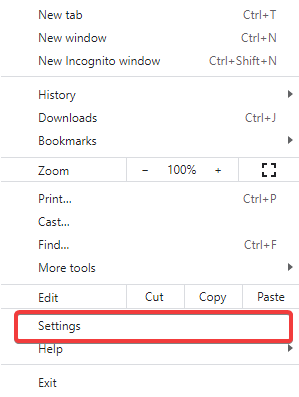
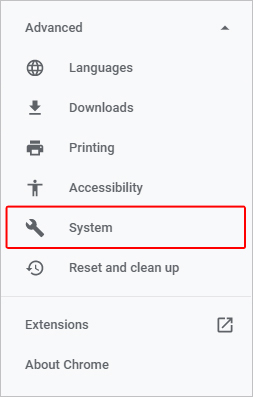
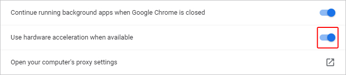

# Strange behaviour of a program using AcuToWeb on an Apple CPU machine
## Environment
AcuToWeb Gateway running in any browser on Apple CPU machines.  
 
## Problem
When running a program in a browser using AcuToWeb, the program can show strange behaviour. Screens can close randomly, and the active entry field can switch randomly to another entry field. This doesn’t happen in the same browsers on machines with an Intel CPU.  
 
## Resolution
There seems to be some incompatibility with web technologies and browsers running on Apple CPU machines. The issue can be avoided by disabling hardware acceleration in the browser.  

For instance, to disable hardware acceleration in the Chrome browser, follow these steps:  
 
1. Open Google Chrome.  
2. Click the  icon in the upper-right corner.  
3. Select Settings from the drop-down menu.   

4. In the menu on the left side of the window, expand the  menu.  
5. Click System.   

6. In the middle of the window, under System, click the toggle switch next to Use hardware acceleration when available to enable or disable hardware acceleration.  

7. Once the change has been made, click the  button.  
**NOTE:** If a program is running in AcuToWeb when 'Relaunch' is clicked, the runtime/program will be closed.  

Other browsers will have a similar process to disable hardware acceleration.   
As of macOS Catalina, users are no longer able to turn hardware acceleration on and off in Safari.  